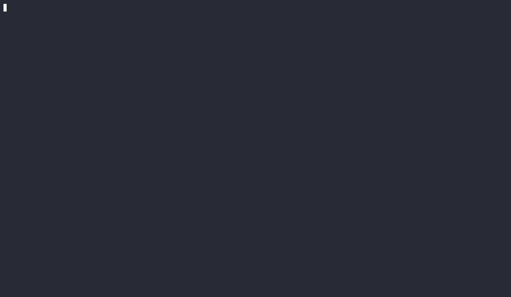

# pkggate

> **Block malicious packages before they reach `node_modules` or `site-packages`.**

A lightweight, self-hosted supply-chain firewall for small and mid-sized teams — free, open-source, and built on public threat intelligence from [OSV.dev](https://osv.dev/).

[](https://github.com/daneb255/pkggate/blob/main/LICENSE)
[](#project-status)
[](contributing.md)

> ⭐ If pkggate helps you, please consider [starring the repo](https://github.com/daneb255/pkggate) to support the project!


---

## Why pkggate?

Software supply-chain attacks against npm and PyPI keep growing — typosquats, account takeovers, and malicious post-install scripts are now everyday threats. Commercial package firewalls exist, but their pricing often locks out small teams, indie developers, and OSS maintainers.

**pkggate is a free, self-hosted alternative:**

- **Zero cost, full control** — runs in your own infrastructure, no vendor lock-in.
- **Drop-in proxy** — point `npm` and `pip` at pkggate; everything else stays the same.
- **Offline-capable threat intel** — local OSV mirror means lookups don't leak which packages you install.
- **Policy-driven** — block by advisory, package age, missing repository links, lifecycle scripts, or explicit allow/deny lists.
- **Auditable** — every decision lands in a JSON Lines audit log.

---

## How it works

pkggate sits between your package manager and the upstream registry. Every request is checked against a local threat-intel mirror and a policy engine. Hits are blocked with HTTP 403 and recorded in the audit log.

```text
+---------+       +----------+       +---------------------+
|  npm /  | --->  | pkggate  | --->  |  npm / PyPI         |
|  pip    |       |          |       |  upstream registry  |
+---------+       |  +-----+ |       +---------------------+
                  |  | OSV | |
                  |  +-----+ |
                  |  +------+|
                  |  |Policy||
                  +--+------+
```

Two checkpoints for npm:

1. **Metadata response** (`GET /<pkg>`) — versions with a `MAL-*` advisory are stripped from the `versions` map so the client never tries to resolve them.
2. **Tarball request** (`GET /<pkg>/-/<pkg>-<ver>.tgz`) — final check before the file is delivered.

Two checkpoints for PyPI:

1. **Simple index gate** (`GET /simple/<project>/`) — fetches upstream, runs intel + policy per version, drops denied files, rewrites surviving file URLs.
2. **File gate** (`GET /packages/<path>`) — re-evaluates policy and verifies SHA-256 integrity before serving.

---

## Project status

!!! warning "Early Preview"
    pkggate is an early-stage prototype. It works end-to-end for npm and PyPI, but APIs, configuration keys, and on-disk formats may still change without notice. Production use is at your own risk — please pin versions and review the audit log.

---

## Layered supply-chain defence

pkggate pairs naturally with [**unravel-sbom**](https://github.com/daneb255/unravel-sbom), a companion open-source CLI that scans your project after installation and generates SBOMs in SPDX 2.3 and CycloneDX 1.6 format, with direct upload to [Dependency-Track](https://dependencytrack.org/).

| Layer | Tool | When |
| --- | --- | --- |
| **Block** bad packages at install time | pkggate | Developer workstation & CI install step |
| **Inventory** what made it in | [unravel-sbom](https://github.com/daneb255/unravel-sbom) | After `npm install` / `pip install` in CI |
| **Monitor** for newly-disclosed CVEs | Dependency-Track (via unravel-sbom) | Continuously |

Run them together for defence-in-depth: pkggate blocks known-malicious packages before they enter `node_modules`; unravel-sbom then captures a signed SBOM of everything that did install and uploads it for continuous vulnerability monitoring.



> ⭐ If [unravel-sbom](https://github.com/daneb255/unravel-sbom) helps you, please consider [starring that repo](https://github.com/daneb255/unravel-sbom) too!

---

## Get started

- [Installation](installation.md) — Docker, Docker Compose, or from source.
- [Quick Start](quickstart.md) — point `npm` and `pip` at pkggate in under 5 minutes.
- [Policy Engine](policy.md) — tune block rules to your organization's risk appetite.
