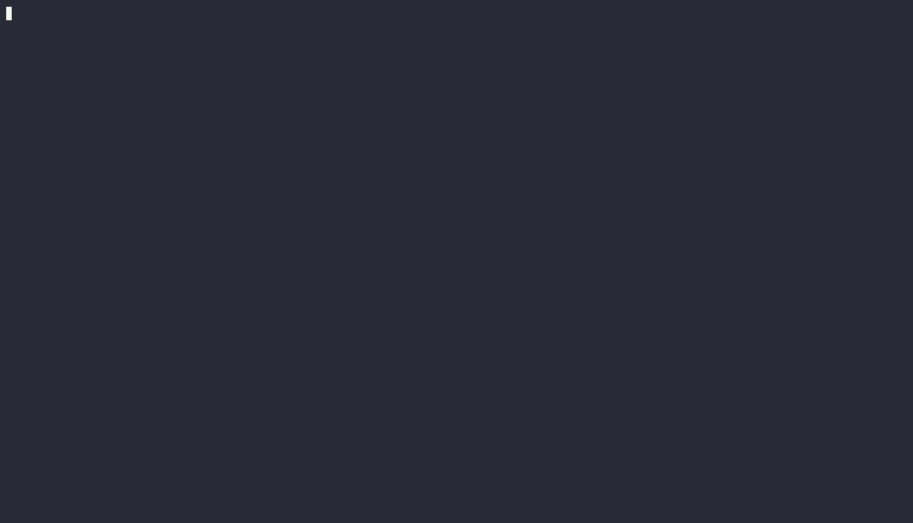

# Policy Engine

pkggate's policy engine controls which packages are blocked and why. Rules are defined in `config/policy.yaml` and take effect immediately on the next request (no restart required — pkggate hot-reloads the policy file).

---

## Fail-closed mode

```yaml
fail_closed: true
```

When `true`, packages are **blocked** if threat-intel checks fail or the OSV mirror is unavailable. When `false`, packages are allowed through on error. The default (`true`) is strongly recommended for production use.

---

## Core rules

### `block_malicious`

```yaml
block_malicious: true
```

Hard-blocks any version flagged with an OSV `MAL-*` advisory. This is the primary rule and should almost always be enabled.

### `max_cvss_score`

```yaml
max_cvss_score: null   # disabled by default
```

Blocks packages whose highest known CVSS base score meets or exceeds the configured threshold. pkggate extracts CVSS v2 and v3 base scores from the `severity` fields of all OSV advisories returned for a package version, then takes the maximum. If that score is ≥ the threshold, the request is denied.

Common thresholds:

| Threshold | Blocks |
| --- | --- |
| `9.0` | Critical severity CVEs only |
| `7.0` | High and critical severity CVEs |
| `4.0` | Medium, high, and critical severity CVEs |

!!! note
    `max_cvss_score` is evaluated **independently** of `block_malicious`. A package can be blocked by either rule or both. The `allowlist` bypasses CVSS blocking just like any other rule.

!!! tip
    Start with `max_cvss_score: 9.0` to limit disruption while still catching the most dangerous known vulnerabilities. Review the audit log for a week before tightening the threshold further.



### `min_package_age_days`

```yaml
min_package_age_days: 7
```

Blocks packages published within the last _N_ days. Typosquat campaigns frequently publish new packages and withdraw them quickly — a short age window catches many of them before they spread.

Recommended values:

| Environment | Setting |
| --- | --- |
| Small team / startup | `7` |
| More permissive | `1` |
| Locked-down / high-security | `30` |

### `require_repository_url`

```yaml
require_repository_url: false
```

Blocks packages that don't advertise a source repository URL. Helps prevent installing abandoned or suspicious packages with no visible source. Disable for OSS-heavy teams (many legitimate packages omit this field).

### `deny_lifecycle_scripts`

```yaml
deny_lifecycle_scripts: false
```

Blocks packages that ship `preinstall`, `postinstall`, or other lifecycle scripts. These scripts run arbitrary code during installation and are a common attack vector. Enabling this is very restrictive — many popular packages (e.g., `esbuild`, `node-gyp`) use lifecycle scripts legitimately.

---

## Package lists

### `allowlist`

Packages listed here are always permitted, regardless of other rules. Use this to override false positives or trust internal packages.

```yaml
allowlist:
  - my-internal-package@1.0.0
  - trusted-vendor/library
```

### `denylist`

Packages listed here are always blocked, overriding the allowlist.

```yaml
denylist:
  - malicious-package@*
  - abandoned-lib@>=2.0.0
```

---

## Per-ecosystem overrides

Any global rule can be overridden for a specific ecosystem. `allowlist` and `denylist` entries are **additive** — global bans are never bypassed.

```yaml
ecosystems:
  npm:
    deny_lifecycle_scripts: false
    min_package_age_days: 7

  PyPI:
    min_package_age_days: 7
```

!!! note
    `deny_lifecycle_scripts` and `require_repository_url` are only meaningful for npm — PyPI's Simple API does not expose these fields.

---

## Example: recommended starter config

```yaml
fail_closed: true
block_malicious: true
max_cvss_score: null        # set to 9.0 to also block critical CVEs
min_package_age_days: 7
require_repository_url: false
deny_lifecycle_scripts: false

allowlist: []
denylist: []

ecosystems:
  npm:
    deny_lifecycle_scripts: false
  PyPI:
    min_package_age_days: 7
```

This blocks all known malicious packages and anything published in the last week, without being so restrictive that it breaks typical workflows. Enable `max_cvss_score: 9.0` to also block packages with critical-severity CVEs sourced from OSV.
